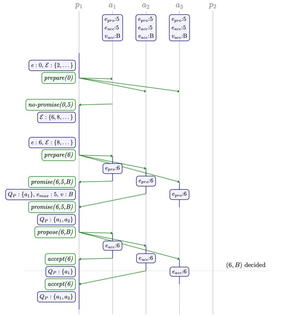

# Paxos revised summary

- Date: Sun Oct 23 2022
- Category: Distributed systems

## Preface

This article is a summary of the [Distributed Consensus Revision](https://www.cl.cam.ac.uk/techreports/UCAM-CL-TR-935.pdf), which presents all the Paxos algorithm
revisions to the Paxos algorithm. I have only written down some of the revised architecture, and have not covered the proofs. If you are interested in the details.
I strongly recommend that you read this paper.

## Classic paxos problems

In the classic paxos algorithm, the most obvious problem is that we need to communicate twice in order to reach consensus.
Even though multi-paxos would in normal circumstances allow us to reduce this number to one.
But single leader also brings the problem of not being able to scale horizontally and the increased write latency of the leader node.

## Known revisions

There are some commonly used  refinements to Classic Paxos algorithm.

### Negative responses(NACKs)

Currently, the Acceptor will not reply to proposers whose epoch is less than their last promised epoch.
Add the ``no-promise(e)`` or ``no-accept(e)`` methods to have the Acceptor notify the proposer and avoid the proposer waiting for their ready timeout.

### Bypassing phase two

### Termination

### Distinguished proposer

### Phase ordering

### Multi-paxos

### Roles

### Epochs

### Phase one voting for epochs

### Proposal copying

### Generalisation to quorums

### Miscellaneous